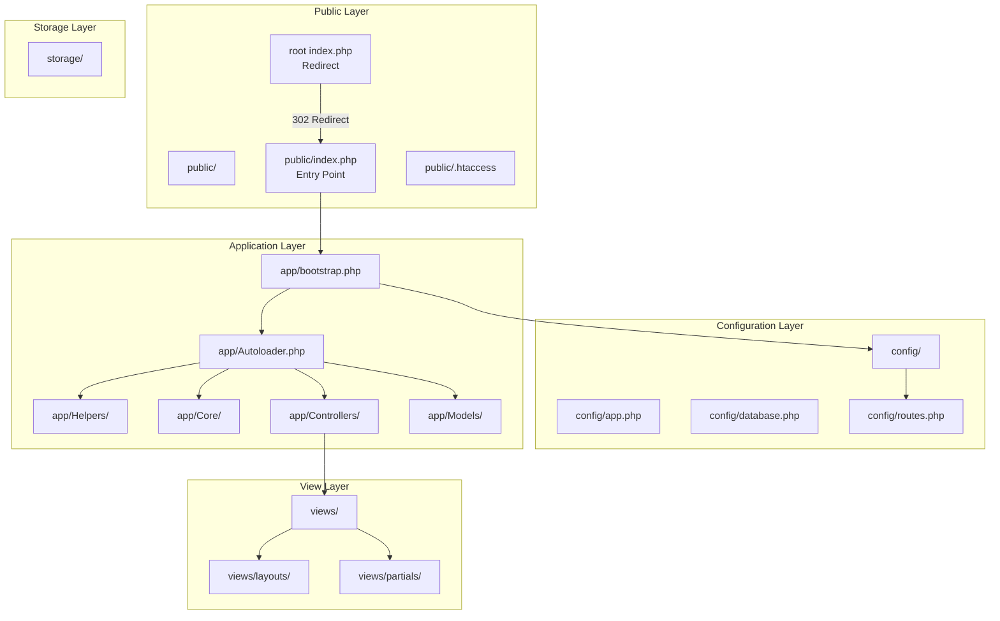
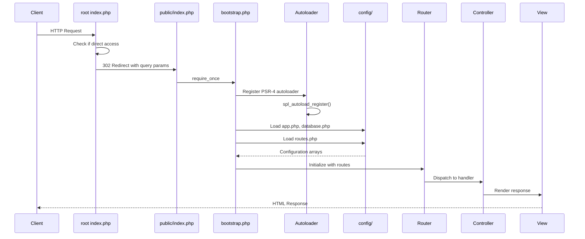
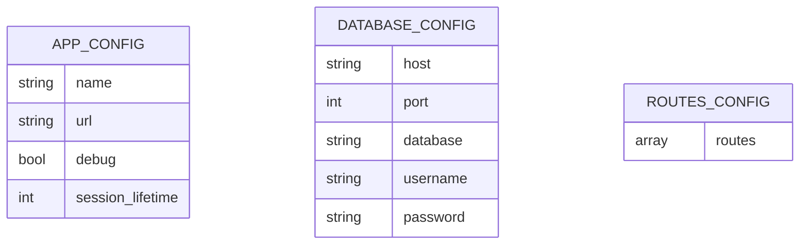

# Design Document: PHP Project Restructure

## Overview

This document defines the technical design for restructuring the Opti Ventas PHP project to follow standard PHP conventions with PSR-4 autoloading. The restructure will improve code organization, maintainability, and adherence to industry best practices while preserving 100% backward compatibility.

### Goals

- Centralize configuration in a dedicated `config/` directory
- Organize helper functions by domain with proper namespacing
- Implement fully compliant PSR-4 autoloading
- Maintain backward compatibility for all existing functionality
- Separate public-facing files from application logic

### Non-Goals

- No framework migration (remaining pure PHP 8.3)
- No database schema changes
- No UI/UX modifications
- No external library additions

---

## Architecture

### High-Level Architecture Diagram



### Directory Structure (Before vs After)

```mermaid
graph LR
    subgraph "Current Structure"
        C1["opti_ventas_php/"]
        C2["├── app/"]
        C3["│   ├── bootstrap.php"]
        C4["│   ├── Helpers.php"]
        C5["│   ├── Core/"]
        C6["│   ├── Controllers/"]
        C7["│   └── Models/"]
        C8["├── config.php"]
        C9["├── routes.php"]
        C10["├── public/"]
        C11["│   └── index.php"]
        C12["└── views/"]
    end

    subgraph "New Structure"
        N1["opti_ventas_php/"]
        N2["├── app/"]
        N3["│   ├── bootstrap.php"]
        N4["│   ├── Autoloader.php"]
        N5["│   ├── Helpers/"]
        N6["│   │   ├── PathHelpers.php"]
        N7["│   │   ├── ConfigHelpers.php"]
        N8["│   │   ├── OutputHelpers.php"]
        N9["│   │   ├── UrlHelpers.php"]
        N10["│   │   ├── RequestHelpers.php"]
        N11["│   │   ├── SessionHelpers.php"]
        N12["│   │   ├── CsrfHelpers.php"]
        N13["│   │   └── FormatHelpers.php"]
        N14["│   ├── Core/"]
        N15["│   ├── Controllers/"]
        N16["│   └── Models/"]
        N17["├── config/"]
        N18["│   ├── app.php"]
        N19["│   ├── database.php"]
        N20["│   └── routes.php"]
        N21["├── index.php (redirect)"]
        N22["├── public/"]
        N23["│   └── index.php"]
        N24["└── views/"]
    end
```



### Data Flow



---

## Components and Interfaces

### Component Overview

| Component | Responsibility | Location |
|-----------|---------------|----------|
| `Autoloader` | PSR-4 class loading | `app/Autoloader.php` |
| `Bootstrap` | Application initialization | `app/bootstrap.php` |
| `Config Loader` | Configuration management | `config/*.php` |
| `Root Index` | Redirect to public entry | `index.php` |
| `Public Index` | Request entry point | `public/index.php` |
| `Helpers` | Utility functions | `app/Helpers/*.php` |

### 1. Autoloader Component

**File:** `app/Autoloader.php`

**Purpose:** Implements PSR-4 compliant class autoloading with proper error handling.

**Interface:**

```php
<?php

declare(strict_types=1);

namespace App;

final class Autoloader
{
    private static bool $registered = false;
    
    /**
     * Register the PSR-4 autoloader.
     * @throws RuntimeException if autoloader file is missing
     */
    public static function register(): void;
    
    /**
     * Load a class file based on PSR-4 mapping.
     * @param string $class Fully qualified class name
     * @throws RuntimeException if class file cannot be found
     */
    public static function load(string $class): void;
    
    /**
     * Resolve a class name to its file path.
     * @param string $class Fully qualified class name
     * @return string Absolute file path
     */
    public static function resolvePath(string $class): string;
}
```

**PSR-4 Namespace Mapping:**

| Namespace | Directory | Example |
|-----------|-----------|---------|
| `App\Core\` | `app/Core/` | `App\Core\Router` → `app/Core/Router.php` |
| `App\Controllers\` | `app/Controllers/` | `App\Controllers\UserController` → `app/Controllers/UserController.php` |
| `App\Models\` | `app/Models/` | `App\Models\User` → `app/Models/User.php` |
| `App\Helpers\` | `app/Helpers/` | `App\Helpers\PathHelpers` → `app/Helpers/PathHelpers.php` |

### 2. Bootstrap Component

**File:** `app/bootstrap.php`

**Purpose:** Initialize application with proper loading order.

**Initialization Sequence:**

1. Start session
2. Register autoloader
3. Load configuration files
4. Configure error reporting
5. Initialize database connection
6. Load routes

**Interface:**

```php
<?php

declare(strict_types=1);

// Session initialization
if (session_status() === PHP_SESSION_NONE) {
    session_start();
}

// Register autoloader FIRST
require_once __DIR__ . '/Autoloader.php';
App\Autoloader::register();

// Load configuration
$config = require_once config_path('app.php');
$dbConfig = require_once config_path('database.php');

// Configure error reporting
// Initialize database
// Load routes
```

### 3. Configuration Files

#### `config/app.php`

```php
<?php

declare(strict_types=1);

return [
    'name' => 'Opti Ventas',
    'url' => env('APP_URL', ''),
    'debug' => env('APP_DEBUG', true),
    'session_lifetime' => 120, // minutes
];
```

#### `config/database.php`

```php
<?php

declare(strict_types=1);

return [
    'host' => env('DB_HOST', '127.0.0.1'),
    'port' => env('DB_PORT', 3306),
    'database' => env('DB_DATABASE', 'opti_ventas_php'),
    'username' => env('DB_USERNAME', 'root'),
    'password' => env('DB_PASSWORD', ''),
];
```

#### `config/routes.php`

```php
<?php

declare(strict_types=1);

// Route definitions (moved from root routes.php)
// Same content as current routes.php
```

### 4. Root Index Redirect

**File:** `index.php` (project root)

**Purpose:** Redirect requests to proper entry point while preserving query parameters.

```php
<?php

declare(strict_types=1);

/**
 * Root index.php - Redirects to public entry point
 * This file handles direct access to the project root
 */

// Preserve query parameters
$queryString = $_SERVER['QUERY_STRING'] ?? '';
$redirectUrl = 'public/index.php' . ($queryString !== '' ? '?' . $queryString : '');

// Perform 302 redirect
header('Location: ' . $redirectUrl, true, 302);
exit;
```

### 5. Helper Organization

**Directory:** `app/Helpers/`

**Files and Functions:**

| File | Functions | Domain |
|------|-----------|--------|
| `PathHelpers.php` | `base_path()`, `app_path()`, `views_path()`, `storage_path()`, `config_path()` | Path resolution |
| `ConfigHelpers.php` | `config()`, `env()` | Configuration access |
| `OutputHelpers.php` | `e()`, `redirect()`, `back()`, `json_response()`, `assert_failed()` | Output handling |
| `UrlHelpers.php` | `scheme()`, `host()`, `url()`, `base_url()`, `app_script_dir()`, `mount_url_prefix()` | URL generation |
| `RequestHelpers.php` | `is_post()`, `request_method()`, `input()`, `query()`, `json_input()`, `request_path()` | Request handling |
| `SessionHelpers.php` | `flash()`, `consume_flash()`, `flash_errors()`, `errors()`, `has_error()`, `field_error()`, `old_input()`, `old()`, `clear_request_state()` | Session management |
| `CsrfHelpers.php` | `csrf_token()`, `csrf_field()`, `csrf_token_valid()` | CSRF protection |
| `FormatHelpers.php` | `now()`, `slugify()`, `money_symbol()`, `money()`, `nullable_string()`, `setting()` | Formatting utilities |

**Example Helper File Structure:**

```php
<?php

declare(strict_types=1);

namespace App\Helpers;

/**
 * Path resolution helper functions.
 * All paths are resolved relative to the project root.
 */

/**
 * Get the absolute path to the project root or a subdirectory.
 */
function base_path(string $path = ''): string
{
    return dirname(__DIR__, 2) . ($path ? DIRECTORY_SEPARATOR . ltrim($path, '/\\') : '');
}

/**
 * Get the absolute path to the app directory.
 */
function app_path(string $path = ''): string
{
    return base_path('app' . ($path ? DIRECTORY_SEPARATOR . ltrim($path, '/\\') : ''));
}

// ... more functions
```

---

## Data Models

### Configuration Schema



### Configuration Loading Flow

```mermaid
flowchart TD
    A[Bootstrap] --> B[Load config/app.php]
    B --> C[Load config/database.php]
    C --> D[Load config/routes.php]
    D --> E{All files found?}
    E -->|Yes| F[Merge into $GLOBALS['__config']]
    E -->|No| G[Throw RuntimeException]
    F --> H[Application Ready]
```

---

## Correctness Properties

*A property is a characteristic or behavior that should hold true across all valid executions of a system—essentially, a formal statement about what the system should do. Properties serve as the bridge between human-readable specifications and machine-verifiable correctness guarantees.*

### Property 1: PSR-4 Path Resolution

*For any* fully qualified class name in the `App\` namespace, the autoloader SHALL resolve the file path by converting namespace separators to directory separators and appending `.php`.

**Validates: Requirements 4.1, 4.2, 4.3**

### Property 2: Configuration Return Arrays

*For any* configuration file in the `config/` directory, the file SHALL return an associative array and SHALL use `declare(strict_types=1)`.

**Validates: Requirements 3.3, 3.4**

### Property 3: Helper Namespace Consistency

*For any* helper file in `app/Helpers/`, the file SHALL declare `namespace App\Helpers` and contain between 1 and 15 functions.

**Validates: Requirements 2.2, 2.4, 10.2**

### Property 4: Helper Function Signature Preservation

*For any* of the 42 existing helper functions, the function signature (name, parameters, return type) SHALL remain identical after migration.

**Validates: Requirements 2.3, 10.3**

### Property 5: Query String Preservation in Redirect

*For any* HTTP request to the root `index.php` with query parameters, the redirect to `public/index.php` SHALL preserve all query parameters in the redirect URL.

**Validates: Requirements 6.2, 6.4**

### Property 6: No Explicit Requires in Controllers and Models

*For any* controller or model file, there SHALL be no explicit `require` or `include` statements for class files (autoloader handles all class loading).

**Validates: Requirements 5.2, 5.3**

### Property 7: View Path Resolution

*For any* view file referenced by the View renderer, the path SHALL resolve correctly relative to the `views/` directory at the project root.

**Validates: Requirements 12.1**

---

## Error Handling

### Error Types and Responses

| Error Type | Condition | Response | HTTP Status |
|------------|-----------|----------|-------------|
| `RuntimeException` | Missing config file | "Configuration file not found: {filename}" | 500 |
| `RuntimeException` | Missing class file | "Class not found: {class} at expected path: {path}" | 500 |
| `PDOException` | Database connection failure | "Database connection failed" (no credentials) | 500 |
| `ParseError` | Routes syntax error | "Route configuration error in: {path}" | 500 |
| `RuntimeException` | Missing required env var | "Required environment variable missing: {var}" | 500 |

### Bootstrap Error Handling

```php
<?php

// In bootstrap.php

/**
 * Load a configuration file with error handling.
 * @throws RuntimeException if file is missing
 */
function load_config(string $name): array
{
    $path = config_path($name . '.php');
    
    if (!file_exists($path)) {
        throw new RuntimeException(
            "Configuration file not found: {$name}.php at path: {$path}"
        );
    }
    
    return require_once $path;
}

/**
 * Validate required environment variables.
 * @throws RuntimeException if required variable is missing
 */
function validate_env(array $required): void
{
    foreach ($required as $var) {
        if (getenv($var) === false && !isset($_ENV[$var])) {
            throw new RuntimeException(
                "Required environment variable missing: {$var}"
            );
        }
    }
}
```

### Autoloader Error Handling

```php
<?php

// In Autoloader.php

public static function load(string $class): void
{
    // Only handle App\ namespace
    if (!str_starts_with($class, 'App\\')) {
        return;
    }
    
    $path = self::resolvePath($class);
    
    if (!file_exists($path)) {
        throw new RuntimeException(
            "Class not found: {$class}. Expected at: {$path}"
        );
    }
    
    require_once $path;
}
```

---

## Testing Strategy

### Testing Approach Summary

This feature involves infrastructure restructuring (directory reorganization, autoloader implementation, configuration management) rather than pure business logic. Property-based testing is applied selectively where universal properties exist, while integration tests verify end-to-end functionality.

### Property-Based Tests (Where Applicable)

**Test Framework:** PHP with `phpunit/phpunit` and custom property test helpers

**Properties to Test:**

1. **Autoloader PSR-4 Resolution**
   - Generate random class names in `App\*` namespace
   - Verify resolved path follows PSR-4 rules
   - 100+ iterations with various namespace depths

2. **Configuration Return Arrays**
   - Verify all `config/*.php` files return arrays
   - Verify all have `declare(strict_types=1)`

3. **Helper Namespace Consistency**
   - Verify all `app/Helpers/*.php` files have correct namespace
   - Verify function count per file is 1-15

4. **Query String Preservation**
   - Generate random query strings
   - Verify redirect preserves query string

**Configuration:**
```php
// Example property test configuration
$propertyTests = [
    'iterations' => 100,
    'timeout' => 5000, // milliseconds
];
```

### Integration Tests

| Test | Purpose | Method |
|------|---------|--------|
| Route Resolution | All existing routes resolve correctly | Visit each route and verify 200 response |
| Database Connection | Connection establishes within 5 seconds | Time connection attempt |
| Authentication Flow | Login/logout/register complete in <3s | Time each flow |
| Security Headers | Sensitive files not accessible | Attempt to access `.env`, `config/`, `app/` |
| View Rendering | All views render correctly | Render each view template |

### Smoke Tests

| Test | Purpose |
|------|---------|
| `config/` directory exists | Verify configuration structure |
| `app/Helpers/` directory exists | Verify helpers structure |
| `public/index.php` exists | Verify entry point |
| `.env.example` exists at root | Verify documentation |
| Autoloader registered | Verify `spl_autoload_register` call |

### Unit Tests (Examples)

| Test | Purpose |
|------|---------|
| Missing config file throws `RuntimeException` | Error handling |
| Missing class throws `RuntimeException` | Autoloader error handling |
| Database connection failure throws `PDOException` | Error handling |
| Root redirect uses 302 status | Redirect behavior |
| Session lifetime is 120 minutes | Configuration |

---

## Migration Plan

### Phase 1: Create New Structure (No Breaking Changes)

**Step 1.1: Create Configuration Directory**

```bash
mkdir config/
```

**Step 1.2: Create Configuration Files**

Create `config/app.php`:
```php
<?php

declare(strict_types=1);

return [
    'name' => 'Opti Ventas',
    'url' => '',
    'debug' => true,
    'session_lifetime' => 120,
];
```

Create `config/database.php`:
```php
<?php

declare(strict_types=1);

return [
    'host' => '127.0.0.1',
    'port' => 3306,
    'database' => 'opti_ventas_php',
    'username' => 'root',
    'password' => '',
];
```

**Step 1.3: Copy Routes to Config**

```bash
cp routes.php config/routes.php
```

**Step 1.4: Create Helpers Directory**

```bash
mkdir app/Helpers/
```

**Step 1.5: Create Autoloader File**

Create `app/Autoloader.php` with PSR-4 implementation.

**Step 1.6: Create Root Index Redirect**

Create `index.php` at project root.

**Verification:** All new files exist, existing functionality unchanged.

### Phase 2: Update Bootstrap (Transition State)

**Step 2.1: Update Bootstrap to Use New Config**

Modify `app/bootstrap.php`:
- Load configuration from `config/` directory
- Maintain backward compatibility with `$GLOBALS['__config']`

**Step 2.2: Create Helper Files**

Split `app/Helpers.php` into domain-specific files:
- `app/Helpers/PathHelpers.php`
- `app/Helpers/ConfigHelpers.php`
- `app/Helpers/OutputHelpers.php`
- `app/Helpers/UrlHelpers.php`
- `app/Helpers/RequestHelpers.php`
- `app/Helpers/SessionHelpers.php`
- `app/Helpers/CsrfHelpers.php`
- `app/Helpers/FormatHelpers.php`

**Step 2.3: Add Global Function Bridge**

Keep original `app/Helpers.php` temporarily with:
```php
<?php

declare(strict_types=1);

// Load all helper files for backward compatibility
require_once __DIR__ . '/Helpers/PathHelpers.php';
require_once __DIR__ . '/Helpers/ConfigHelpers.php';
// ... etc
```

**Verification:** All routes still work, tests pass.

### Phase 3: Update Public Index

**Step 3.1: Update public/index.php**

```php
<?php

declare(strict_types=1);

require_once dirname(__DIR__) . '/app/Autoloader.php';
App\Autoloader::register();

require dirname(__DIR__) . '/app/bootstrap.php';
require config_path('routes.php');

clear_request_state();
```

**Verification:** Application loads correctly, all routes work.

### Phase 4: Cleanup (Remove Legacy Files)

**Step 4.1: Update Bootstrap for Full Autoloader**

Remove explicit `require` statements from bootstrap:
- Remove `require __DIR__ . '/Core/Database.php';`
- Remove `require __DIR__ . '/Core/Auth.php';`
- Remove `require __DIR__ . '/Core/View.php';`
- Remove `require __DIR__ . '/Core/Validator.php';`

**Step 4.2: Remove Legacy Helpers Bridge**

Delete or empty the original `app/Helpers.php` file.

**Step 4.3: Remove Legacy Config File**

Delete `config.php` from project root.

**Step 4.4: Remove Legacy Routes File**

Delete `routes.php` from project root.

**Verification:** Full test suite passes, all routes work, no errors in logs.

### Migration Order Summary

```mermaid
gantt
    title Migration Timeline
    dateFormat X
    axisFormat %s

    section Phase 1
    Create config/ directory           :a1, 0, 1
    Create config/*.php files          :a2, after a1, 1
    Create app/Helpers/ directory      :a3, 0, 1
    Create app/Autoloader.php          :a4, 0, 1
    Create root index.php redirect     :a5, 0, 1

    section Phase 2
    Update bootstrap.php               :b1, after a2, 1
    Create Helper files                :b2, after a3, 1
    Create backward compat bridge      :b3, after b2, 1

    section Phase 3
    Update public/index.php            :c1, after b1, 1
    Verify all routes work             :c2, after c1, 1

    section Phase 4
    Remove Core requires from bootstrap :d1, after c2, 1
    Remove legacy Helpers.php bridge    :d2, after d1, 1
    Delete config.php                   :d3, after d1, 1
    Delete routes.php                   :d4, after d1, 1
    Final verification                  :d5, after d4, 1
```



---

## Design Decisions

### Decision 1: Return Arrays vs define() for Configuration

**Chosen:** Return arrays

**Rationale:**
- **Testability:** Return arrays can be easily mocked in tests
- **Lazy Loading:** Configuration is only loaded when needed
- **Composition:** Multiple config files can be merged programmatically
- **Type Safety:** PHPStan/Psalm can validate array structures
- **Flexibility:** Environment-specific overrides are easier to implement
- **Modern Practice:** PSR-11 container-interop encourages this pattern

**Alternative Considered:** `define()` constants
- Rejected: Cannot be mocked, loaded unconditionally, global namespace pollution

### Decision 2: Backward Compatibility Strategy

**Chosen:** Gradual migration with bridge files

**Rationale:**
- **Risk Mitigation:** Each phase can be independently verified
- **Rollback Safety:** Can revert individual phases without full rollback
- **Testing:** Easier to isolate issues during migration
- **User Impact:** Zero downtime during migration

**Implementation:**
1. Keep `app/Helpers.php` as a bridge that loads new helper files
2. Keep `$GLOBALS['__config']` for config access
3. Maintain all function signatures exactly

### Decision 3: Helper Organization by Domain

**Chosen:** 8 domain-specific files

**Rationale:**
- **Discoverability:** Related functions are grouped together
- **Maintainability:** Changes to one domain don't affect others
- **Autoloading:** Only needed helpers are loaded
- **Testing:** Each domain can be tested independently

**File Organization:**

| Domain | Function Count | Purpose |
|--------|----------------|---------|
| Path | 5 | File path resolution |
| Config | 2 | Configuration access |
| Output | 5 | Response handling |
| URL | 6 | URL generation |
| Request | 6 | HTTP request handling |
| Session | 9 | Session management |
| CSRF | 3 | CSRF protection |
| Format | 6 | Data formatting |

### Decision 4: Autoloader Path Resolution

**Chosen:** Centralized in `app/Autoloader.php`

**Rationale:**
- **Single Responsibility:** Autoloading logic is isolated
- **Error Handling:** Consistent error messages for missing classes
- **Debugging:** Clear path resolution logic
- **Testing:** Autoloader can be tested independently

**Path Resolution Algorithm:**

```php
/**
 * PSR-4 Path Resolution:
 * 1. Check if class starts with 'App\'
 * 2. Remove 'App\' prefix
 * 3. Replace '\' with DIRECTORY_SEPARATOR
 * 4. Prepend app/ directory
 * 5. Append .php extension
 * 
 * Example: App\Core\Router → app/Core/Router.php
 */
```

### Decision 5: Root Index.php Redirect Strategy

**Chosen:** PHP-based redirect (not .htaccess)

**Rationale:**
- **Portability:** Works regardless of web server (Apache, Nginx, etc.)
- **Explicitness:** Redirect logic is visible in code
- **Query Preservation:** PHP can easily access `$_SERVER['QUERY_STRING']`
- **Status Code Control:** Explicit 302 redirect

**Alternative Considered:** .htaccess redirect only
- Rejected: Nginx doesn't use .htaccess, less portable

---

## Verification Checklist

### Pre-Migration Verification

- [ ] Backup database
- [ ] Backup all files
- [ ] Run existing tests (if any)
- [ ] Document current route list
- [ ] Document current helper function list

### Phase 1 Verification

- [ ] `config/` directory exists
- [ ] `config/app.php` exists and returns array
- [ ] `config/database.php` exists and returns array
- [ ] `config/routes.php` exists
- [ ] `app/Helpers/` directory exists
- [ ] `app/Autoloader.php` exists
- [ ] `index.php` exists at root
- [ ] All existing routes still work

### Phase 2 Verification

- [ ] Bootstrap loads config from `config/`
- [ ] All helper files exist in `app/Helpers/`
- [ ] All 42 helper functions still callable
- [ ] All routes still work
- [ ] No PHP errors in logs

### Phase 3 Verification

- [ ] `public/index.php` uses autoloader
- [ ] All Core classes load via autoloader
- [ ] All routes still work
- [ ] Database connection works
- [ ] Authentication flows work

### Phase 4 Verification

- [ ] No explicit `require` statements in controllers
- [ ] No explicit `require` statements in models
- [ ] `config.php` deleted from root
- [ ] `routes.php` deleted from root
- [ ] `app/Helpers.php` bridge removed
- [ ] All routes work
- [ ] All tests pass
- [ ] No deprecated warnings
- [ ] Response times under 2000ms

### Final Verification

- [ ] All 12 requirements met
- [ ] No PHP errors
- [ ] No security warnings
- [ ] Performance within thresholds
- [ ] Documentation updated
